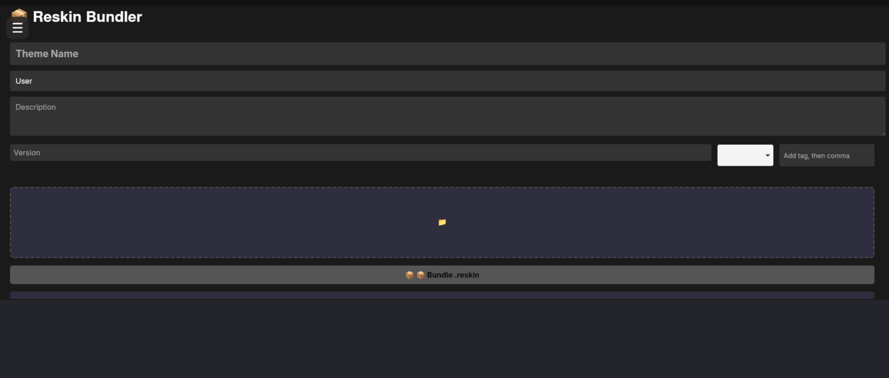

<div align="center">
    
</div>

<br>

Reskin is a modern Linux desktop theming app for browsing, applying, and managing custom themes. It supports portable `.reskin` theme packages and provides a simple GUI for theme management across different desktop environments.

  



Learn more at: https://reskinapp.github.io

## Installation

> **⚠️** Please note that Reskin currently does not support NixOS.

Reskin can be installed in 3 different ways:

### Prebuilt binary
This is the easiest and most common method to install Reskin. 
Before installation, please make sure you have installed the necessary [prerequisites](https://reskinapp.github.io/guides/quick-start/prerequisites/).

1. Go to the [Releases](https://github.com/iamnotmega/reskin/releases) page and download the latest pre-built binary.

2. Once the binary is downloaded, you need to make the binary executable:

### For GUI file managers (e.g Nautilus)
Find the downloaded binary, right-click on it and select Properties and then toggle on "Executable as a program" to make it executable.

### For terminals
Find the downloaded binary (usually its in `~/Downloads`, the ~ representing your home directory) and use the `chmod` command to make it executable:
```bash
chmod +x reskin
```

3. Now that the binary is executable, you can run it:

### For GUI file managers (e.g Nautilus)
You should just be able to double-click the program to run it, otherwise you can right-click and select "Run as a program"

### For terminals
Run the binary: 
```bash
./reskin
```

### Manual installation
> ⚠️ This installation method is not recommended for beginners and should only be used by advanced users. If you are a beginner, we strongly suggest using a pre-built binary instead.

1. Clone the repository using `git`:

```bash
git clone https://github.com/iamnotmega/reskin
```

2. `cd` into the cloned repository:
```bash
cd reskin/src-tauri
```

3. Use `npm` to install the Node modules:
```bash
npm install
```

4. Build the frontend with `npm`:
```bash
npm run build
```

5. Build the binary using `cargo`:
```bash
cargo build --release
```

6. Once the binary has been created, run it:
```bash
target/release/reskin
```

### AUR (Arch User Repository)
> ℹ️ Please note that this method of installation only works on Arch Linux or distributions based on it.

1. If you haven't already, install an AUR helper like `yay`:
```bash
git clone https://aur.archlinux.org/yay.git
cd yay
makepkg -si
```

2. Install Reskin from the AUR:
```bash
yay -S reskin
```

For nightly preview builds:
```bash
yay -S reskin-git
```

Once you have installed Reskin using your preferred method, take a look at the [usage instructions](https://reskinapp.github.io/guides/how-to-use/welcome/) to get started.

## Star History

[](https://www.star-history.com/#iamnotmega/reskin&type=date&legend=top-left)
